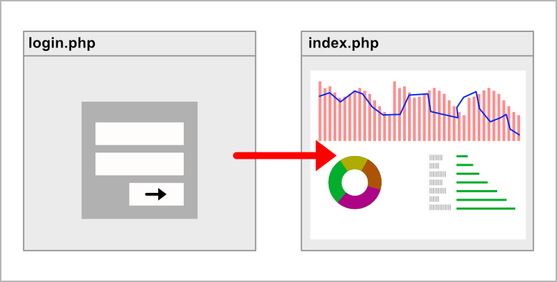
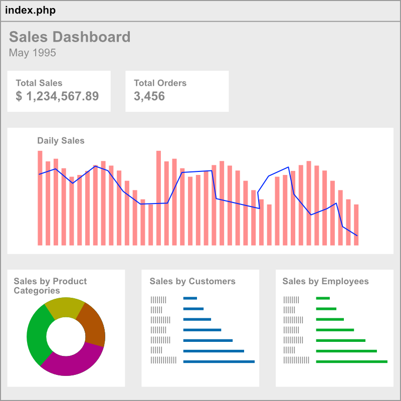

# Kiddocare Assignment

Thank you for applying to our PHP Developer position at Kiddocare. For our selection process, we would require that you complete this assignment and submit it to us before 5pm, 11th September 2021, Kuala Lumpur time.

Please read the instructions carefully.

## Important!

It is important that you do this assignment yourself to reflect your own true ability to perform the tasks. You are free to do research on the Internet, use Google, Stackoverflow, Youtube videos, books, and any other resources available to you. However do not ask for assistance from anybody else to complete this assignment.

## Assignment 1

You are required to make an authentication process for this project. A user should be able to login, access a secure page, and logout. Without a valid login, a user should not be able to access the secure page, and will be redirected to login.php.

Below are the files that must be present in this project.

1. `index.php` -- the secure page
2. `login.php` -- to display the login screen
3. `logout.php` -- to process logout and redirect user to login.php
4. `users.txt` -- contains user credentials for authentication

### Rules

1. User credentials for authentication must be accessed from `users.txt` file. Do not import this into your MySQL database.
2. Each row in `users.txt` contains the following information `<username>`|`<password>`
3. You are **not allowed** to use any PHP frameworks like Laravel, Codeigniter, Yii, etc
4. You are **not allowed** to use Composer to import any external PHP libraries
5. You are **not allowed** to use NPM, Yarn or any other CLI for frontend libraries.
6. You are **allowed** to use any CSS framework like Tailwind or Bootstrap
7. You are **allowed** to use any frontend Javscript libraries like jQuery or VueJS
8. Any frontend libraries for CSS and/or Javascript must be added via CDN. 
9. Your own custom CSS and Javascript files must be added in /css and /js folder respectively

## Assignment 2

Continuing from **Assignment 1**, the secure page is to be developed into a dashboard that displays data from `northwind` database.

### Instructions

1. Create a new empty database in your local MySQL
2. Import the `northwindmysql.sql` file into your local database
3. Study the database to understand its table relationships
4. Update `index.php` to display a dashboard from the `northwind` database
5. You may use any charting and diagram library that you feel fit
6. Any frontend libraries for CSS and/or Javascript must be added via CDN. 
7. Your dashboard must display data for the month May 1995
8. Your dashboard must contain the following 6 widgets
   1. Total Sales (text number)
   2. Total Orders (text number)
   3. Daily Sales (bar chart)
   4. Percentage of sales by product categories (sales percentage breakdown for the month)
   5. Sales numbers by customers
   6. Sales numbers by employees
9. You may add any additional PHP files of your own as needed, ie, `dbconnect.php`, `libraries.php`

### Bonus

* Make the dashboard dynamic where the a user can select the month period to view for the dashboard

## Submission

To submit your assignment, please following the instructions below :

1. Create a new public Github project
2. Push all your work to your new Github project using the `main` branch
3. Send an email to iszuddin@kiddocare.my with subject line **Kiddocare PHP Developer Assignment Submission**
4. Provide the link to your Github project in the email
5. Your email must arrive in our Inbox before 5:00 pm, 11th September 2021, Kuala Lumpur time.
